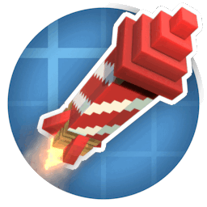

     
    
    
    

<h1>Create Missiles</h1>

This is a Minecraft mod for Forge and Fabric that adds missiles to the game, built as an addon for the Create mod.

<h1>Contributors</h1>
<ul>
    <li>Woukie</li>
    <li>ExpertSalad (missile mechanics)</li>
    <li>Diomorphus (structures)</li>
</ul>

<h1>Attribution</h1>
<ul>
    <li>BlockBench (models)</li>
    <li>Easings.net (some UI animations)</li>
    <li>Blender (icon)</li>
    <li>ezgif.com</li>
</ul>

Implementation details

<ul>
    <li>Built on Architectury, for Fabric and Forge</li>
    <li>Compiled with Java 21</li>
    <li>Development starting at 1.20.1 for Create 5</li>
    <li>Distributed on GitHub, CurseForge and Modrinth</li>
    <li>Licenced under `GNU GENERAL PUBLIC LICENSE V3`</li>
    <li>If you see another site distributing the mod, it's not me. Lmk if you want me to consider distributing elsewhere</li>
</ul>
